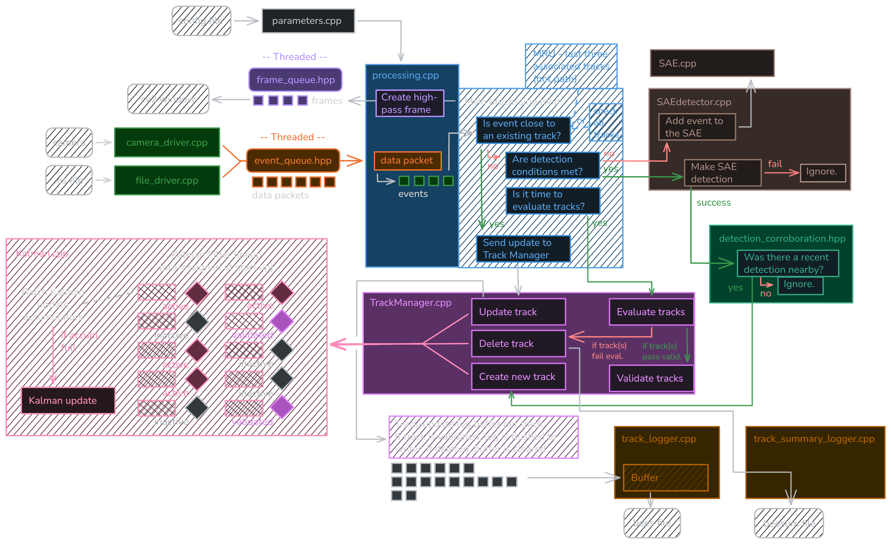

<a name="top"></a>

# Real-time 'Asynchronous Multi-Object Tracking with an Event Camera' (AEMOT) with Neuromorphic Drivers

> Now in real-time!



## Quick Links!
[](#how-to-install-and-build)  
[](#how-to-use)  
[](#logging-tracks-to-file)

## About

### ***For academic use only!***

This is currently a work in progress.

This package takes the core of a reduced version of the AEMOT code (developed by Angus Apps, Ziwei Wang, Vladimir Perejogin, Timothy L. Molloy, and Robert Mahony) and configures it for real-time event data input and tracking using Neuromorphic System's Gen4 C++ Neuromorphic Drivers.

You can see the original full AEMOT code on GitHub below. The exact, reduced, code that this package here was based on was provided directly by one of the original authors, and is not publically accessible at the time of writing this.

***Currently only works with the Prophesee Gen4 EVK4 event camera!***

### <ins>Built with:</ins>
[](https://github.com/angus-apps/AEMOT)  
[](https://github.com/neuromorphicsystems/gen4)


<p align="right"><a href="#top">↑ go back to top</a></p>

## How to install and build
***<ins>Enviornment note:</ins>*** This set up has been designed and tested for an Ubuntu setup (tested on Ubuntu 26.04, but a solid earlier version like Ubuntu 24.04 will likely work even better). Running on Windows is probably possible, but you will need to consult the gen4 page on how to build their drivers with Windows (not covered on this page, Ubuntu is assumed here).

This set up requires Neuromorphic System's Gen4 Neuromorphic Drivers to interact with the Gen4 camera in real-time.  
The project layout needs to look like this (so that `aemot_realtime` and `gen4` are ***sister*** folders):
```txt
working_directory
    |
    |---- /aemot_realtime
    |         |---- /configs
    |         |---- /src
    |         |---- README.md
    |
    |---- /gen4
    |       |---- /app
    |       |---- /common
    |       |---- ... etc.
```
To do this, follow these steps:

**<ins>Step 1: Install and build the gen4 content</ins>**  
See the [gen4 GitHub page](https://github.com/neuromorphicsystems/gen4) for further details, if needed...
```bash
# create a working directory and gen4 subfolder:
# note that the working_directory folder name can be what you want (just be consistent)
cd ~
mkdir -p working_directory/gen4
cd working_directory/gen4

# install prerequisites:
sudo apt install -y curl build-essential git libusb-1.0-0-dev qtbase5-dev qtdeclarative5-dev qml-module-qtquick-controls qml-module-qtquick-controls2 qml-module-qttest

# clone the gen4 repository (ensure you add the '.' at the end)
git clone https://github.com/neuromorphicsystems/gen4.git .

# build the content
cd app
curl -L https://github.com/premake/premake-core/releases/download/v5.0.0-beta2/premake-5.0.0-beta2-linux.tar.gz | tar xz
./premake5 gmake
cd build
make

# create system rules to access the cameras properly
sudo nano /etc/udev/rules.d/65-event-based-cameras.rules
# paste the following:
SUBSYSTEM=="usb", ATTR{idVendor}=="152a",ATTR{idProduct}=="84[0-1]?", MODE="0666"
SUBSYSTEM=="usb", ATTR{idVendor}=="04b4",ATTR{idProduct}=="00f[4-5]", MODE="0666"
# then press ctr+O and then ENTER to save, then ctr+X to exit.
```

**<ins>Step 2: Install this repository</ins>**  
```bash
# create the aemot_realtime subfolder:
cd ~/working_directory
mkdir aemot_realtime
cd aemot_realtime

# clone this repository (ensire you add the '.' at the end)
git clone https://github.com/TobysWorkshop/AEMOT-realtime.git .
```

**<ins>Step 3: Build the project!</ins>**  
The included CMakelists.txt should resolve the relative file paths and includes as necessary. To build, then, do the following:
```bash
# install dependencies (just do this once on project set up)
sudo apt install cmake libboost-dev libopencv-dev libyaml-cpp-dev libeigen3-dev libusb-1.0-0-dev

# navigate to aemot_realtime/ and build!
cd ~/working_directory/aemot_realtime
cmake -B build
cmake --build build -j$(nproc)
# This will create the build/ directory inside aemot_realtime/
```

Now everything is ready to use!

***<ins>Notes on different setups:</ins>*** This exact sister-folder setup is required because some of the C++ files in this project have hard-coded references to include required files from the gen4 directory. If you'd like to alter the file arrangements, or even merge this project code with the required gen4 files, then you will need to update these `#include` references.  
NOTE: the above has now been changed to rely on the includes in the CMakelists.txt, rather than hard-coded #includes in the individual .cpp files.

<p align="right"><a href="#top">↑ go back to top</a></p>

## How to use
This project provides two ways of running the system: <ins>realtime streaming from a gen4 camera</ins>, and <ins>replaying from a .es file</ins>.

### <ins>Streaming from a gen4 camera (`aemot_realtime`)</ins>
Once you've built the project, you can run the ***aemot_realtime*** executable using the following command (from `aemot_realtime/`):
```bash
cd ~working_directory/aemot_realtime
./build/aemot_realtime <config_name>
```
Where `<config_name>` is the name of your desired config file. This must be located inside the `aemot_realtime/configs/` directory.  
For example, if I have a config file `aemot_realtime/configs/bees.yaml`, then I would simply pass `bees` into the command (**<ins>not</ins>** `bees.yaml`!):  
`./build/aemot_realtime bees`

If no `<config_name>` is provided, it should default to the included `default.yaml` file: `aemot_realtime/configs/default.yaml`.

### <ins>Replaying from a .es file (`aemot_replay`)</ins>
Once you've built the project, you can run the ***aemot_replay*** executable using the following command (from `aemot_realtime/`):
```bash
cd ~working_directory/aemot_realtime
./build/aemot_replay <config_name> <.es_file_location>
```
Where `<config_name>` follows the same requirements as above, and `<.es_file_location>` is a path relative to `aemot_realtime/`. There is a `/data` folder included in this repo, which is designed for this very purpose: place your .es files in here and then the command becomes:
```
./build/aemot_replay <config_name> ./data/<file_name>.es
```

<p align="right"><a href="#top">↑ go back to top</a></p>

## Logging tracks to file
The system has a built-in ability to log every validated track's kalman state at each update instance to a custom ***.bees (Binary Event Evolution Storage) file***. This is done by default while the system is running in real-time or replaying from a file.  
The system will also create a custom ***.beesum (Binary Event Evolution Summary) file***. This contains a single summary log per validated track, which holds some key metrics about that track, including why it ended, as well as the covariance at its endpoint.

Upon starting a run, a pair of .bees and .beesum files for that run will be created in the `aemot_realtime/track_logs/` folder with a timestamped file name: `<DD-MM-YYYY-hh-mm-ss>.bees` and `<DD-MM-YYYY-hh-mm-ss>.beesum`, respectedly.

### <ins>.bees File Format:</ins>

| Item | Type | Value | Bytes |
| -------- | -------- | -------- | -------- |
| **<ins>Header (24 bytes)</ins>** |
| Magic bytes  | char[8] | "A E M O T L O G"  | 8  |
| version | uint32 | 2 | 4 |
| n_state | uint32 | 8, *length of each track update's state vector* | 4 |
| record_size | uint32 | 80, *the size of one track update log* | 4 |
| reserved | uint32 | 0 | 4 |
| **<ins>Kalman log record (80 bytes), repeated</ins>** |
| track_id | uint64 | *unique id of the track this update belongs to* | 8 |
| ts | double | time | 8 |
| Kalman filter state vector, *x_hat[8]* | double | x, y, vx, vy, lambda1, lambda2, theta, q | 64 |
| **. . .** |

### <ins>.beesum File Format:</ins>

| Item | Type | Value | Bytes |
| -------- | -------- | -------- | -------- |
| **<ins>Header (24 bytes)</ins>** |
| Magic bytes  | char[8] | "A E M O T S U M"  | 8  |
| version | uint32 | 2 | 4 |
| state_dim | uint32 | 8, *length of each track update's state vector* | 4 |
| record_size | uint32 | 624, *the size of one track summary record* | 4 |
| reserved | uint32 | 0 | 4 |
| **<ins>Track summary record (624 bytes), repeated</ins>** |
| track_id | uint64 | *unique id of the track this update belongs to* | 8 |
| t_created | double | *time this track was first created* | 8 |
| t_validated | double | *time this track was validated* | 8 |
| t_deleted | double | *time this track ended* | 8 |
| num_records | uint32 | *how many induvidual logs this track has in the .bees file* | 4 |
| delete_reason | uint32 | *6-option bitmask, why was the track deleted? (see table below)* | 4 |
| event_rate_at_deletion | double | *1.0 / dt_moving_average at the time the track ended* | 8 |
| x_hat_at_deletion[8] | double | *Kalman state vector when the track ended:* x, y, vx, vy, lambda1, lambda2, theta, q | 64 |
| P_at_deletion[64] | double | *row major, symmetric, flattened P matrix when the track ended* | 512 |
| **. . .** |

### <ins>Deletion Reason Bitmask *(for the relevant .beesum file parameter - see above)*:</ins>
| Reason | Bitmask |
| -------- | -------- |
| OUT_OF_FRAME | 1u << 0 |
| INACTIVE | 1u << 1 |
| LOW_ACTIVITY | 1u << 2 |
| BAD_SHAPE | 1u << 3 |
| DUPLICATE_TRACK | 1u << 4 |
| STILL_ACTIVE_AT_SHUTDOWN | 1u << 5 |

Note that multiple bits can be set, e.g. a track can be both out of frame AND inactive simultaneously. This just logs whatever checks failed when this track was deleted. The *STILL_ACTIVE_AT_SHUTDOWN* means that the track was still active when the system shut down.

<p align="right"><a href="#top">↑ go back to top</a></p>

## Understanding the Config File
WIP...

<p align="right"><a href="#top">↑ go back to top</a></p>

## Running the Included Offline Track Plotting/Verification
WIP...

<p align="right"><a href="#top">↑ go back to top</a></p>

## Other notes
System diagram at the top of this README was made using [Excalidraw](https://excalidraw.com). See their GitHub page [HERE](https://github.com/excalidraw/excalidraw) for more info.

